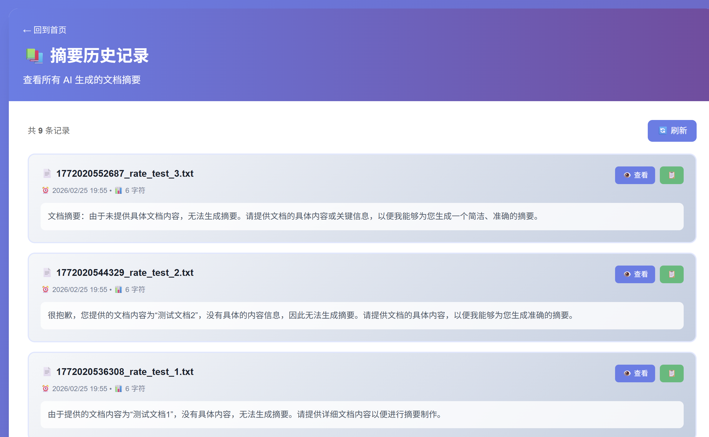
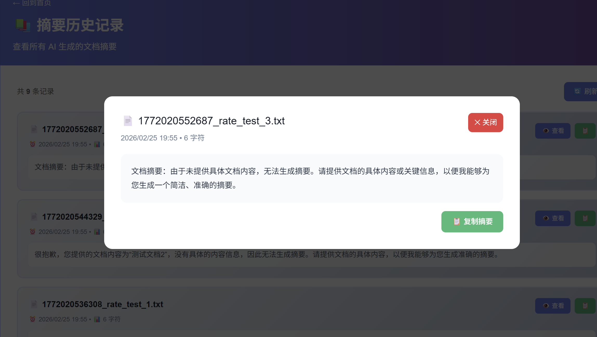
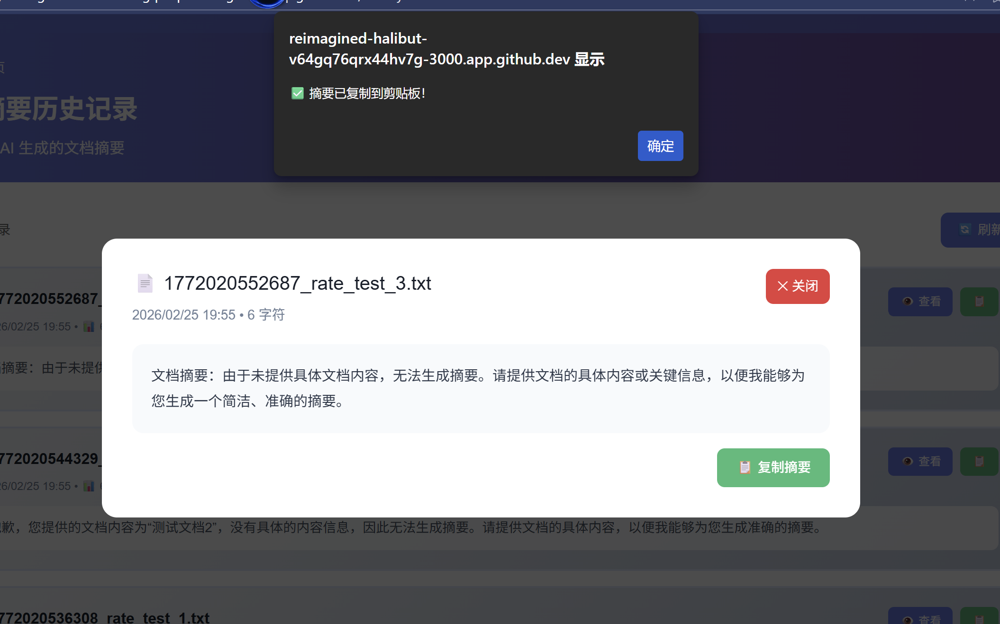

## Section 6: Supabase Object Store
Supabase is an open-source Firebase alternative that provides developers with a complete backend-as-a-service platform centered around PostgreSQL, a powerful relational database system offering full SQL capabilities, real-time subscriptions, and robust extensions for scalable data management. Its object storage is an S3-compatible service designed for storing and serving files like images, videos, and user-generated content.

Website: https://supabase.com/

**Requirements**:
- Build a document upload and file management system powered by Supabase. The backend will include API endpoints to interact with Supabse.
- **Note:** The detailed requirement will be discussed in week 4 lecture.
- Make regular commits to the repository and push the update to Github.
- Capture and paste the screenshots of your steps during development and how you test the app. Show a screenshot of the documents stored in your Supabase Object Database.

Test the app in your local development environment, then deploy the app to Vercel and ensure all functionality works as expected in the deployed environment.

**Steps with major screenshots:**

> [your steps and screenshots go here]
！[文件上传](image/上传.png)
！[文件上传](image/上传2.png)
！[文件查看](image/查看.png)
！[文件删除](image/删除.png)
！[supabse](image/supabase.png)
！[vercel deployment](image/deployment.png)
## Section 7: AI Summary for documents
**Requirements:**  
- **Note:** The detailed requirement will be discussed in week 4 lecture.
- Make regular commits to the repository and push the update to Github.
- Capture and paste the screenshots of your steps during development and how you test the app.
- The app should be mobile-friendly and have a responsive design.
- **Important:** You should securely handlle your API keys when pushing your code to GitHub and deploying your app to the production.
- When testing your app, try to explore some tricky and edge test cases that AI may miss. AI can help generate basic test cases, but it's the human expertise to  to think of the edge and tricky test cases that AI cannot be replace. 

Test the app in your local development environment, then deploy the app to Vercel and ensure all functionality works as expected in the deployed environment. 

**Steps with major screenshots:**

> [your steps and screenshots go here]
**实现与测试步骤**
- 本地依赖安装：
cd my-app
npm install
- 本地环境变量
存放在放在 my-app/.env.local
- 本地功能验证
！[文件上传](image/上传.png)
！[文本摘要](image/生成摘要.png)
！[边界与异常测试](image/空文档.png)
操作：上传 0 字节文件并调用 /api/upload → /api/summary。
期望：后端返回 400，消息 "文件为空"，前端显示友好错误
！[边界与异常测试](image/非法命名处理.png)
操作：上传文件名含中文或特殊字符（例如 空文档.txt）。
处理：后端对文件名做 sanitize（将非法字符替换为 _）或使用 UUID 作为 key，避免 Supabase 报 Invalid key。
！[超长文本](image/超长文本.png)
！[摘要缓存](image/缓存.png)
数据库缓存：避免重复调用
为每个文件缓存已生成的摘要，避免重复调用API
！[部署vercel](image/部署.png)

## Section 8: Database Integration with Supabase  
**Requirements:**  
- Enhance the app to integrate with the Postgres database in Supabase to store the information about the documents and the AI generated summary.
- Make regular commits to the repository and push the update to Github.
- Capture and paste the screenshots of your steps during development and how you test the app.. Show a screenshot of the data stored in your Supabase Postgres Database.

Test the app in your local development environment, then deploy the app to Vercel and ensure all functionality works as expected in the deployed environment.

**Steps with major screenshots:**

> [your steps and screenshots go here]
！[数据库]（image/数据库.png）
![sql查询]（image/sql查询.png）
## Section 9: Additional Features [OPTIONAL]
Implement at least one additional features that you think is useful that can better differentiate your app from others. Describe the feature that you have implemented and provide a screenshot of your app with the new feature.

> [Description of your additional features with screenshot goes here]

vercel部署：ai-summary-app-7u52-git-main-zenaychen-2617s-projects.vercel.app